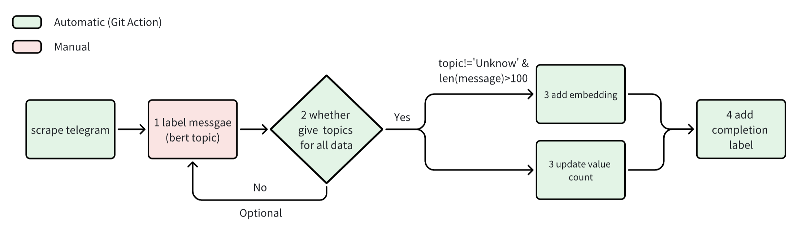

# pipeline
## design logic

## stage description
| stage | logic                                                                                    | output                                               | status         |
|-------|------------------------------------------------------------------------------------------|------------------------------------------------------|----------------|
| 0     | check the amount of new coming messages                                                  | print the number of meesages that need to be trained | DONE           |
| 1     | Filter new coming data using 'topicUpdateDate' field. Make bert topic prediction         | add 'predicted_class' field. String                  | TODO zhengyuan |
| 2.1   | Filter new coming data and judge which message should have embedding. Generate embedding | add 'embedding' field. Array                         | DONE           |
| 2.2   | use new topic results to update value count table                                        | update aggregate.TelegramCount                       | TODO zhengyuan |
| 3     | add completion label                                                                     | add 'topicUpdateDate' field. String                  | DONE           |
