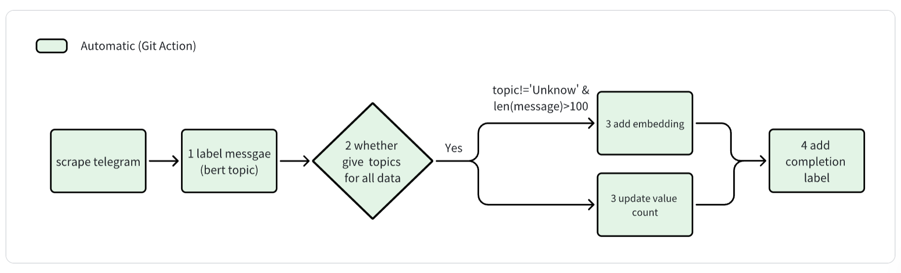
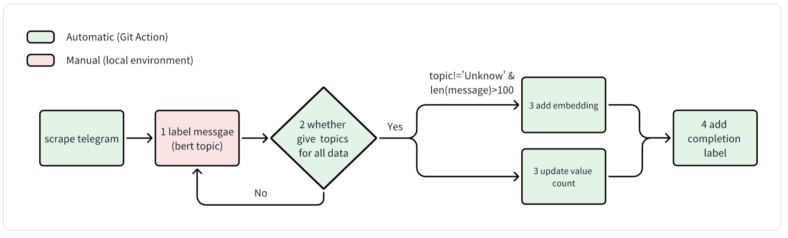

# pipeline
## design logic
(1) current design

Pipeline:    
.github/workflows/Telegram_All_Process.yml

(2) when the size of bert model exceed Free tier (500MB)

Pipeline:     
Telegram_Part1_Scraping.yml   
Telegram_Part2_Bertopic_Embedding.yml

Step 2 just services as a checking script, which is unneeded for current design. However, owing to the storage constraint for Github Action's free tier, Step 1 may neet to be manually run in the local environment.     We may set error throwing in step 2 (not have now), which will compel step 2 to fail when developers fail to do step 1 manually on time. As a result, the repo owner receives emails, reruns step1, and restart pipeline 'Telegram_Part2_Bertopic_Embedding' (step 2-4) in Github Action.

## stage description
| stage | logic                                                                                    | output                                                                 | status |
|-------|------------------------------------------------------------------------------------------|------------------------------------------------------------------------|--------|
| 1     | Filter new coming data using 'topicUpdateDate' field. Make bert topic prediction         | add 'predicted_class' field  in the scrape.telegram collection. String | DONE   |
| 2     | check how many data don't have topic labels.                   | print the number of messages that need to topic labels                 | DONE   |
| 3.1   | Filter new coming data and judge which message should have embedding. Generate embedding | add 'embedding' field in the scrape.telegram collection. Array         | DONE   |
| 3.2   | use new topic results to update value count table                                        | overwrite 'aggregate.TelegramCount' collection                         | DONE   |
| 4     | add completion label                                                                     | add 'topicUpdateDate' field in the scrape.telegram collection. String  | DONE   |

The pipeline relies on the following fields and relevant logic.     
- predicted_class: all messages have this field. Give 'Unknown' label if the topic is unclear.    
- embedding: only messages which meet certain requirements have this field.    
- topicUpdateDate: when finish topic prediction and embedding generation, add the completion label to each message in form of 'yyyy-mm-dd'   

Don't change the logic of these fields!!! Or the pipeline has the possibility to run incorrectly. 
